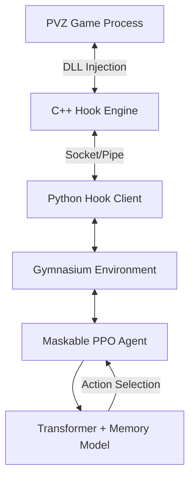

# TransformerPVZ: 基于注意力机制的强化学习植物大战僵尸 AI

<div align="center">


**TransformerPVZ** 是一个前沿的强化学习项目，旨在利用 **Transformer (Attention Mechanism)** 和 **记忆增强网络** 自动攻克《植物大战僵尸》生存模式无尽）。

> [!IMPORTANT]
> **测试成果**：本项目已成功打通 **普通白天无尽模式**，达到了惊人的 **98.4% 胜率**！你可以根据需要自行调整模型架构或训练方法。

[项目概览](#项目概览) • [核心创新](#核心创新) • [架构设计](#架构设计) • [快速开始](#快速开始) • [训练指南](#训练指南) • [项目结构](#项目结构)

中文文档 | [English](README_EN.md)

</div>

---

## 🎬 演示 (Demo)

<div align="center">


*AI 正在自动进行生存模式的策略规划与植物摆放*

</div>

---

## 🏆 基准测试成果 (Benchmark Achievement)

<div align="center">


**我们的 AI 在白天无尽模式中达到了惊人的 98.4% 胜率！**

这一里程碑证明了我们基于 Transformer 注意力机制和记忆增强学习方法在处理复杂长期策略游戏中的有效性。

</div>

---

## 📖 项目概览

本项目通过 C++ 编写的高性能 Hook 注入技术，实时获取游戏内存状态，并将其转化为结构化张量输入。AI 核心基于 **Maskable PPO** 算法，配合自定义的 **Transformer 特征提取器**，能够像人类玩家一样理解战场布局、预判僵尸威胁并进行长线策略规划。

### 目标场景

- **模式**: 生存模式 (无尽)
- **挑战**: 动态阳光管理、多线防御协同、高压波次应对。

### 无尽模式关卡选择 (Survival Endless Stages)

本项目支持通过修改配置文件选择不同的无尽场景。在 `config/training_config.yaml` 中修改 `game_mode_id` 即可切换：

| Stage | 场景名称 | `game_mode_id` | 说明 |
| :--- | :--- | :--- | :--- |
| **Stage 1** | 白天无尽 (Day) | `11` | 5行草地，无特殊地形 |
| **Stage 2** | 黑夜无尽 (Night) | `12` | 5行草地，有墓碑，阳光产出低 |
| **Stage 3** | **泳池无尽 (Pool)** | `13` | **默认推荐**，6行地图（含2行水域） |
| **Stage 4** | 迷雾无尽 (Fog) | `14` | 6行地图，有迷雾遮挡 |
| **Stage 5** | 屋顶无尽 (Roof) | `15` | 5行屋顶，有坡度影响，需花盆 |

> [!TIP]
> 切换场景后，请务必同步修改 `config/training_config.yaml` 中的 `map` (如 `pool`, `day`, `roof`) 和 `rows` (5 或 6)，以确保 AI 能正确识别网格。

---

## 🚀 核心创新

### 1. 结构化注意力特征提取器 (`PVZAttentionExtractor`)

不同于传统的 CNN，我们采用了专门设计的 Transformer 架构：

- **跨维度注意力**: 实现草地网格 (Grid)、全局状态 (Global) 与卡片属性 (Card) 之间的信息融合。
- **多尺度空间感知**: 自动识别前排肉盾、中排输出与后排辅助的战略价值。
- **动态威胁感知**: 实时分析僵尸位置与类型，动态调整防御重心。

### 2. 记忆增强系统

- **短期记忆 (LSTM)**: 捕捉最近几秒内的战场动态趋势，如僵尸位移速度。
- **长期记忆 (Memory Bank)**: 可检索的关键历史状态，帮助 AI 在长达数小时的无尽模式中保持策略一致性。

### 3. 高性能通信架构

- **C++ Hook 引擎**: 毫秒级内存读写，直接从游戏引擎获取原始状态数据，实现零延迟同步。
- **Action Masking**: 结合游戏逻辑，自动过滤非法操作（如阳光不足、冷却中、地形不匹配），极大提升训练效率。

---

## 🏗️ 架构设计



---

## 🛠️ 快速开始 (Quick Start)

### 环境要求

- **操作系统**: Windows 10/11 (游戏原生环境)
- **Python**: 3.10 (推荐)
- **游戏版本**: 《植物大战僵尸》年度版 (v1.0.0.1051)

> [!IMPORTANT]
> **游戏声明**: 本项目核心基于 **v1.0.0.1051** 版本开发。请确保您的游戏版本一致，否则内存偏移量（Offsets）可能失效。
> **本项目不提供游戏本体**。请将您的游戏可执行文件（通常为 `PlantsVsZombies.exe`）放置在项目根目录下的 `gameobj\` 文件夹中。

---

## 📖 使用教程 (Tutorial)

本教程将引导你从零开始配置环境、启动训练并监控 AI 的学习过程。

### 1. 环境准备

#### 1.1 Python 环境
建议使用 Python 3.10。你可以选择使用 `venv` 或 `Conda`。

**使用 venv:**
```bash
python -m venv .venv
.venv\Scripts\activate
pip install -r requirements.txt
```

**使用 Conda:**
```bash
conda env create -f environment.yml
conda activate pvz_ai
```

#### 1.2 游戏文件
1. 准备《植物大战僵尸》年度版 (v1.0.0.1051)。
2. 将 `PlantsVsZombies.exe` 放入项目根目录的 `gameobj/` 文件夹。
3. 运行 `gameobj/窗口化运行.reg` 确保游戏以窗口模式运行。

> [!WARNING]
> **重要提示**：游戏可执行文件 **必须** 放在 `gameobj/` 目录中。训练脚本会在该位置查找游戏文件。如果游戏文件不在正确位置，AI 训练将无法启动。

### 2. 配置详解

项目的主要配置位于 `config/training_config.yaml`。

#### 2.1 游戏模式选择
在 `game` 节点下修改 `game_mode_id`：
- `13`: 泳池无尽 (默认)
- `11`: 白天无尽
- `15`: 屋顶无尽

#### 2.2 植物卡组配置
在 `cards` 节点下，你可以自定义 AI 使用的 10 张卡片。每张卡片需要指定 `id` (参考 `data/plants.py`) 和 `slot` (0-9)。

### 3. 启动训练

运行以下命令开始训练：
```bash
python train.py
```

#### 训练过程说明：
1. **自动注入**: 脚本会自动检测并启动游戏，然后将 `pvz_hook.dll` 注入到游戏内存中。
2. **Action Masking**: AI 会自动过滤掉当前不可用的动作（如阳光不足或冷却中），这能显著加快学习速度。
3. **自动重启**: 如果游戏意外崩溃，脚本会尝试重新启动并继续训练。

### 4. 监控与评估

#### 4.1 TensorBoard 监控
训练时，日志会保存在 `logs/` 文件夹。运行：
```bash
tensorboard --logdir ./logs/
```
重点关注 `rollout/ep_rew_mean` (平均奖励) 和 `train/loss` (损失函数)。

#### 4.2 观察 AI 表现
你可以随时观察游戏窗口。AI 会像人类一样点击卡片并放置植物。
- **变速**: 如果觉得太慢，可以在 `config.py` 中将 `game_speed` 调高（最高建议 10.0）。

### 5. 常见问题排查

- **DLL 注入失败**: 请确保以管理员权限运行终端。
- **找不到游戏进程**: 检查 `config.py` 中的 `game_path` 是否正确。
- **显存溢出 (OOM)**: 如果你的 GPU 显存较小，请在 `training_config.yaml` 中减小 `batch_size` 或 `n_steps`。

### 6. 进阶：自定义奖励函数

如果你发现 AI 的行为不符合预期（例如不爱种向日葵），可以修改 `envs/pvz_env.py` 中的 `_calculate_reward` 函数：

```python
def _calculate_reward(self):
    reward = 0
    # 增加收集阳光的奖励权重
    reward += self.state.sun_collected * 0.1
    # 增加植物存活奖励
    reward += len(self.state.plants) * 0.01
    return reward
```

修改后保存并重新启动 `train.py` 即可生效。

---

## ⚙️ 动态配置与变速

### 1. 变速功能 (Game Speed)
本项目支持通过内存 Hook 直接修改游戏逻辑刻频率，实现 **1x - 10x** 的无损变速：
- **训练建议**: 建议在训练时开启 **10x** 变速，以获得极高的采样效率。
- **命令行调整**: 使用 `-s` 或 `--speed` 参数，例如 `python train.py --speed 5.0`。
- **配置文件**: 在 `config.py` 中修改 `game_speed` 字段。

### 2. 路径配置
为了方便项目发布与迁移，所有关键路径均可在 `config.py` 中动态配置：
- `game_path`: 游戏本体路径。
- `model_load_path`: 预训练模型加载路径（设为 `None` 则从零开始）。
- `model_save_path`: 训练结果保存路径。

---

## ⚠️ 注意事项与风险提示

- **崩溃风险**: 由于涉及内存读写与汇编注入，程序在运行过程中可能存在崩溃风险。建议用户根据需求进一步完善代码的健壮性（如增加异常捕获、自动重启机制等）。
- **路径硬编码**: 目前部分路径可能存在硬编码，请在运行前仔细检查 `train.py` 及相关配置文件。
- **游戏文件要求**: 确保将 `PlantsVsZombies.exe` (v1.0.0.1051) 放置在 `gameobj/` 目录中，否则训练无法启动。

---

## 🛠️ 二次开发指引

如果你想根据自己的需求修改 AI 的行为或适配新的关卡，可以参考以下路径：

### 1. 修改模型架构

- **路径**: `models/attention_extractor.py`
- **说明**: 你可以在这里调整 Transformer 的层数、注意力头数或特征融合逻辑。

### 2. 调整奖励函数 (Reward Function)

- **路径**: `envs/pvz_env.py` 中的 `_calculate_reward` 方法。
- **说明**: 默认奖励基于阳光收集、僵尸击杀和植物存活。你可以增加对特定阵型的奖励。

### 3. 自定义动作空间

- **路径**: `engine/action.py` 和 `envs/pvz_env.py`。
- **说明**: 如果你想让 AI 使用更多种类的植物或执行特殊操作（如使用能量豆，如果版本支持），需要在此处扩展。

### 4. 游戏数据与偏移量

- **路径**: `data/offsets.py` 和 `data/plants.py`。
- **说明**: 如果你的游戏版本不同，可能需要更新内存偏移量。

---

## 📂 项目结构

```text
├── config/             # 训练与游戏配置文件 (YAML)
├── core/               # 核心接口逻辑，封装内存读写
├── data/               # 游戏数据常量 (植物、僵尸、偏移量等)
├── engine/             # 动作执行引擎，处理植物种植与铲除
├── envs/               # Gymnasium 环境实现，包含奖励函数设计
├── game/               # 游戏对象状态建模 (Grid, Plant, Zombie, etc.)
├── gameobj/            # 游戏可执行文件目录 (在此放置 PlantsVsZombies.exe)
├── hook/               # C++ Hook 源代码，实现高性能数据抓取
├── hook_client/        # Python 与 DLL 通信客户端 (Socket/Protocol)
├── memory/             # 内存读写、进程附加与汇编注入工具
├── models/             # Transformer & Attention 模型定义
├── tools/              # 辅助工具 (一键解锁、金币修改等)
├── utils/              # 通用工具类 (日志、坐标转换、伤害计算)
├── train.py            # 训练入口脚本 (包含自动启动与注入逻辑)
└── README.md           # 项目说明文档
```

---

## 🔧 常见问题 (FAQ)

**Q: 游戏无法自动启动或注入失败怎么办？**
A: 
1. 请确保以管理员身份运行终端。
2. 检查 `train.py` 中的 `DEFAULT_GAME_PATH` 是否正确指向了您的游戏程序。
3. 确保游戏进程名为 `PlantsVsZombies.exe`。
4. 如果自动注入失败，可以尝试手动运行游戏后再启动脚本。

**Q: 程序运行中途崩溃了？**
A: 内存注入存在一定不稳定性。建议定期保存模型，并考虑在代码中增加自动重启逻辑。

**Q: 训练速度慢？**
A: 建议开启 `Action Masking`，并在 `training_config.yaml` 中调整 `n_envs` 以利用多核并行。

---

## 🎮 游戏辅助功能指引

### 快速跳关 (关卡选择)

如果你想让 AI 训练特定关卡或模式，可以通过修改内存直接进入目标关卡。参考 `memory/level_control.py` 中的实现：

```python
from memory.writer import MemoryWriter
from data.offsets import Offset

# 进入泳池无尽模式 (Survival: Pool Endless)
writer.write_int(Offset.GAME_MODE, 71)  # 71 为泳池无尽模式代码

# 进入白天无尽模式 (Survival: Day Endless)
writer.write_int(Offset.GAME_MODE, 70)  # 70 为白天无尽模式代码

# 其他常用模式代码：
# 0  - 冒险模式 (Adventure)
# 1  - 小游戏 (Mini-Games)
# 11 - 解谜模式 (Puzzle)
# 61-70 - 生存模式关卡
```

**快捷脚本**：你也可以使用 `tools/unlock_all.py` 一键解锁所有关卡。

### 更换植物 (自定义卡组)

训练不同策略时，你可能需要更换植物配置。修改 `data/plants.py` 中的可用植物列表：

```python
# 在 envs/pvz_env.py 的 reset() 方法中
AVAILABLE_PLANTS = [
    PlantType.SUNFLOWER,      # 向日葵
    PlantType.PEASHOOTER,     # 豌豆射手
    PlantType.WALL_NUT,       # 坚果墙
    PlantType.SNOW_PEA,       # 寒冰射手
    PlantType.CHOMPER,        # 大嘴花
    # ... 添加你需要的植物
]
```

**动态植物选择**：如果想让 AI 根据波次自动选择植物，可以在 `envs/pvz_env.py` 中实现 `_select_plants_for_wave()` 方法。

**参考资源**：更多关于内存偏移量和游戏机制的信息，请参考 [AsmVsZombies](https://github.com/mshmsh5955/AsmVsZombies) 项目的文档。

---

## 🗺️ 路线图 (Roadmap)

- [x] 基于 Transformer 的特征提取器。
- [x] C++ 高性能 Hook 引擎。
- [x] 基础生存模式训练。
- [x] **白天无尽模式达到 98.4% 胜率**。
- [ ] **课程学习 (Curriculum Learning)**: 从简单关卡逐步过渡到无尽模式。
- [ ] **多智能体协作**: 模拟多个 AI 协同防守不同行。
- [ ] **Web 监控面板**: 实时可视化 AI 的注意力热力图。

---

## 🤝 致谢 (Acknowledgements)

本项目在开发过程中参考了以下优秀的开源项目和工具，特此致谢：

- **[re-plants-vs-zombies](https://github.com/LeonS-S/re-plants-vs-zombies)**: 提供了深入的游戏逆向工程参考。
- **[pvzclass](https://github.com/lmintlcx/pvzclass)**: 强大的 C++ 类库，简化了内存操作逻辑。
- **[AsmVsZombies](https://github.com/mshmsh5955/AsmVsZombies)**: 提供了宝贵的汇编注入与游戏逻辑分析。
- **pvztools / pvztoolkit**: 提供了便捷的游戏辅助与调试工具。

## ⚖️ 免责声明

本项目仅供学术研究和技术交流使用。本框架提供了一个高度可扩展的机器学习实验环境，欢迎开发者基于此进行二次开发。请勿用于任何形式的商业用途或破坏游戏公平性的行为。所有版权归原游戏开发商 PopCap Games 所有。

---

<div align="center">
    <p>Made with  Alan Ruskin </p>
</div>
