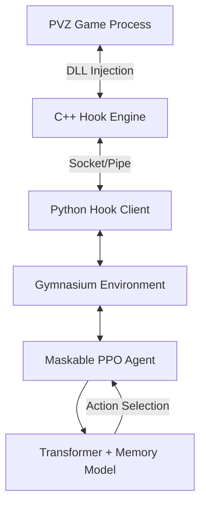

# TransformerPVZ: Reinforcement Learning AI for Plants vs. Zombies Based on Attention Mechanism

<div align="center">


**TransformerPVZ** is a cutting-edge reinforcement learning project that utilizes **Transformer (Attention Mechanism)** and **Memory-Augmented Networks** to automatically master the Survival: Endless mode in Plants vs. Zombies.

> [!IMPORTANT]
> **Achievement**: This project has successfully conquered **Day Endless Mode** with an impressive **98.4% win rate**! You can customize the model architecture or training methods according to your needs.

[Project Overview](#project-overview) • [Core Innovation](#core-innovation) • [Architecture Design](#architecture-design) • [Quick Start](#quick-start) • [Training Guide](#training-guide) • [Project Structure](#project-structure)

[中文文档](README.md) | English

</div>

---

## 🎬 Demo

<div align="center">


*AI automatically performs strategy planning and plant placement in Survival mode*

</div>

---

## 🏆 Benchmark Achievement

<div align="center">


**Our AI has achieved a remarkable 98.4% win rate in Day Endless Mode!**

This milestone demonstrates the effectiveness of our Transformer-based attention mechanism and memory-augmented learning approach in handling complex, long-term strategic gameplay.

</div>

---

## 📖 Project Overview

This project uses high-performance C++ Hook injection technology to capture real-time game memory states and convert them into structured tensor inputs. The AI core is based on the **Maskable PPO** algorithm, combined with a custom **Transformer Feature Extractor**, enabling it to understand battlefield layouts, predict zombie threats, and perform long-term strategic planning just like human players.

### Target Scenario

- **Mode**: Survival Mode (Endless)
- **Challenges**: Dynamic sun management, multi-lane defense coordination, and high-pressure wave responses.

### Survival Endless Stages

This project supports different endless scenarios by modifying the configuration file. Change the `game_mode_id` in `config/training_config.yaml`:

| Stage | Stage Name | `game_mode_id` | Description |
| :--- | :--- | :--- | :--- |
| **Stage 1** | Day Endless | `11` | 5 lawn rows, no special terrain |
| **Stage 2** | Night Endless | `12` | 5 lawn rows, with gravestones, low sun production |
| **Stage 3** | **Pool Endless** | `13` | **Default recommended**, 6 rows (including 2 water lanes) |
| **Stage 4** | Fog Endless | `14` | 6 rows with fog obstruction |
| **Stage 5** | Roof Endless | `15` | 5 roof rows with slope, requires flower pots |

> [!TIP]
> After switching scenarios, make sure to synchronize the `map` (e.g., `pool`, `day`, `roof`) and `rows` (5 or 6) settings in `config/training_config.yaml` to ensure the AI can correctly identify the grid.

---

## 🚀 Core Innovation

### 1. Structured Attention Feature Extractor (`PVZAttentionExtractor`)

Unlike traditional CNNs, we use a specially designed Transformer architecture:

- **Cross-Dimensional Attention**: Enables information fusion between Grid, Global state, and Card attributes.
- **Multi-Scale Spatial Awareness**: Automatically identifies the strategic value of front-row tanks, mid-row damage dealers, and back-row support.
- **Dynamic Threat Perception**: Real-time analysis of zombie positions and types to dynamically adjust defensive priorities.

### 2. Memory Enhancement System

- **Short-Term Memory (LSTM)**: Captures recent battlefield dynamics, such as zombie movement speed.
- **Long-Term Memory (Memory Bank)**: Retrievable key historical states help the AI maintain strategic consistency during hours-long endless modes.

### 3. High-Performance Communication Architecture

- **C++ Hook Engine**: Millisecond-level memory read/write, directly acquiring raw state data from the game engine for zero-latency synchronization.
- **Action Masking**: Combined with game logic to automatically filter illegal operations (insufficient sun, cooldown, terrain mismatch), greatly improving training efficiency.

---

## 🏗️ Architecture Design



---

## 🛠️ Quick Start

### Requirements

- **OS**: Windows 10/11 (native game environment)
- **Python**: 3.10 (recommended)
- **Game Version**: Plants vs. Zombies Game of the Year Edition (v1.0.0.1051)

> [!IMPORTANT]
> **Game Setup**: This project is developed based on **v1.0.0.1051**. Please ensure your game version matches, or memory offsets may fail.
> **This project does not provide the game itself**. Please place your game executable (usually `PlantsVsZombies.exe`) in the `gameobj\` folder at the project root directory.

---

## 📖 Tutorial

This tutorial will guide you through setting up the environment, starting training, and monitoring the AI's learning process.

### 1. Environment Setup

#### 1.1 Python Environment
Python 3.10 is recommended. You can use either `venv` or `Conda`.

**Using venv:**
```bash
python -m venv .venv
.venv\Scripts\activate
pip install -r requirements.txt
```

**Using Conda:**
```bash
conda env create -f environment.yml
conda activate pvz_ai
```

#### 1.2 Game Files
1. Prepare Plants vs. Zombies Game of the Year Edition (v1.0.0.1051).
2. Place `PlantsVsZombies.exe` in the project's `gameobj/` folder.
3. Run `gameobj/窗口化运行.reg` to ensure the game runs in windowed mode.

> [!WARNING]
> **Critical**: The game executable **MUST** be placed in the `gameobj/` directory. The training script expects to find it there. Without the game file in the correct location, the AI training cannot start.

### 2. Configuration Details

The main configuration is in `config/training_config.yaml`.

#### 2.1 Game Mode Selection
Modify `game_mode_id` under the `game` node:
- `13`: Pool Endless (default)
- `11`: Day Endless
- `15`: Roof Endless

#### 2.2 Plant Card Configuration
Under the `cards` node, you can customize the 10 cards the AI uses. Each card needs an `id` (refer to `data/plants.py`) and a `slot` (0-9).

### 3. Start Training

Run the following command to begin training:
```bash
python train.py
```

#### Training Process:
1. **Auto Injection**: The script automatically detects and starts the game, then injects `pvz_hook.dll` into the game memory.
2. **Action Masking**: The AI automatically filters unavailable actions (insufficient sun or cooling down), significantly speeding up learning.
3. **Auto Restart**: If the game crashes unexpectedly, the script attempts to restart and continue training.

### 4. Monitoring and Evaluation

#### 4.1 TensorBoard Monitoring
Training logs are saved in the `logs/` folder. Run:
```bash
tensorboard --logdir ./logs/
```
Focus on `rollout/ep_rew_mean` (average reward) and `train/loss` (loss function).

#### 4.2 Observe AI Performance
You can observe the game window at any time. The AI will click cards and place plants like a human player.
- **Speed Control**: If it's too slow, increase `game_speed` in `config.py` (maximum recommended 10.0).

### 5. Troubleshooting

- **DLL Injection Failure**: Ensure you run the terminal with administrator privileges.
- **Game Process Not Found**: Check if `game_path` in `config.py` is correct.
- **GPU Out of Memory (OOM)**: If your GPU memory is limited, reduce `batch_size` or `n_steps` in `training_config.yaml`.

### 6. Advanced: Custom Reward Function

If you find the AI's behavior doesn't meet expectations (e.g., doesn't plant enough sunflowers), modify the `_calculate_reward` function in `envs/pvz_env.py`:

```python
def _calculate_reward(self):
    reward = 0
    # Increase reward weight for sun collection
    reward += self.state.sun_collected * 0.1
    # Add reward for plant survival
    reward += len(self.state.plants) * 0.01
    return reward
```

Save the changes and restart `train.py` to apply.

---

## ⚙️ Dynamic Configuration and Speed Control

### 1. Game Speed
This project supports direct modification of game logic tick frequency through memory hooks, enabling **1x - 10x** lossless speed control:
- **Training Recommendation**: Enable **10x** speed during training for extremely high sampling efficiency.
- **Command Line Adjustment**: Use the `-s` or `--speed` parameter, e.g., `python train.py --speed 5.0`.
- **Configuration File**: Modify the `game_speed` field in `config.py`.

### 2. Path Configuration
All key paths can be dynamically configured in `config.py` for easy project distribution and migration:
- `game_path`: Game executable path.
- `model_load_path`: Pre-trained model loading path (set to `None` to start from scratch).
- `model_save_path`: Training result save path.

---

## ⚠️ Notes and Risk Warnings

- **Crash Risk**: Due to memory read/write and assembly injection, the program may crash during operation. Users are advised to further improve code robustness (e.g., add exception handling, auto-restart mechanisms).
- **Path Hardcoding**: Some paths may currently be hardcoded. Please carefully check `train.py` and related configuration files before running.
- **Game Files Required**: Ensure `PlantsVsZombies.exe` (v1.0.0.1051) is placed in the `gameobj/` directory before training.

---

## 🛠️ Development Guide

If you want to modify the AI's behavior or adapt to new levels, refer to the following paths:

### 1. Modify Model Architecture

- **Path**: `models/attention_extractor.py`
- **Description**: Adjust the number of Transformer layers, attention heads, or feature fusion logic.

### 2. Adjust Reward Function

- **Path**: `envs/pvz_env.py`, `_calculate_reward` method.
- **Description**: Default rewards are based on sun collection, zombie kills, and plant survival. You can add rewards for specific formations.

### 3. Custom Action Space

- **Path**: `engine/action.py` and `envs/pvz_env.py`.
- **Description**: If you want the AI to use more plant types or execute special operations (like using power-ups if version supports), expand here.

### 4. Game Data and Offsets

- **Path**: `data/offsets.py` and `data/plants.py`.
- **Description**: If your game version differs, you may need to update memory offsets.

---

## 📂 Project Structure

```text
├── config/             # Training and game configuration files (YAML)
├── core/               # Core interface logic, encapsulating memory read/write
├── data/               # Game data constants (plants, zombies, offsets, etc.)
├── engine/             # Action execution engine, handling plant planting and removal
├── envs/               # Gymnasium environment implementation, including reward function design
├── game/               # Game object state modeling (Grid, Plant, Zombie, etc.)
├── gameobj/            # Game executable directory (place PlantsVsZombies.exe here)
├── hook/               # C++ Hook source code, implementing high-performance data capture
├── hook_client/        # Python-DLL communication client (Socket/Protocol)
├── memory/             # Memory read/write, process attachment, and assembly injection tools
├── models/             # Transformer & Attention model definitions
├── tools/              # Auxiliary tools (one-click unlock, coin modification, etc.)
├── utils/              # Common utility classes (logging, coordinate conversion, damage calculation)
├── train.py            # Training entry script (includes auto-start and injection logic)
└── README.md           # Project documentation
```

---

## 🔧 FAQ

**Q: Game won't auto-start or injection fails?**
A: 
1. Ensure you run the terminal with administrator privileges.
2. Check if `DEFAULT_GAME_PATH` in `train.py` correctly points to your game executable.
3. Ensure the game process name is `PlantsVsZombies.exe`.
4. If auto-injection fails, try manually running the game before starting the script.

**Q: Program crashes mid-run?**
A: Memory injection has inherent instability. Save models regularly and consider adding auto-restart logic to the code.

**Q: Training is slow?**
A: Enable `Action Masking` and adjust `n_envs` in `training_config.yaml` to leverage multi-core parallelism.

---

## 🎮 Game Assistance Features Guide

### Quick Level Skip (Level Selection)

If you want the AI to train on specific levels or modes, you can directly enter target levels by modifying memory. Refer to the implementation in `memory/level_control.py`:

```python
from memory.writer import MemoryWriter
from data.offsets import Offset

# Enter Pool Endless Mode (Survival: Pool Endless)
writer.write_int(Offset.GAME_MODE, 71)  # 71 is Pool Endless mode code

# Enter Day Endless Mode (Survival: Day Endless)
writer.write_int(Offset.GAME_MODE, 70)  # 70 is Day Endless mode code

# Other common mode codes:
# 0  - Adventure Mode
# 1  - Mini-Games
# 11 - Puzzle Mode
# 61-70 - Survival Mode Levels
```

**Quick Script**: You can also use `tools/unlock_all.py` to unlock all levels with one click.

### Change Plants (Custom Deck)

When training different strategies, you may need to change plant configurations. Modify the available plant list in `data/plants.py`:

```python
# In the reset() method of envs/pvz_env.py
AVAILABLE_PLANTS = [
    PlantType.SUNFLOWER,      # Sunflower
    PlantType.PEASHOOTER,     # Peashooter
    PlantType.WALL_NUT,       # Wall-nut
    PlantType.SNOW_PEA,       # Snow Pea
    PlantType.CHOMPER,        # Chomper
    # ... add plants you need
]
```

**Dynamic Plant Selection**: If you want the AI to automatically select plants based on waves, implement the `_select_plants_for_wave()` method in `envs/pvz_env.py`.

**Reference Resources**: For more information on memory offsets and game mechanics, refer to the [AsmVsZombies](https://github.com/mshmsh5955/AsmVsZombies) project documentation.

---

## 🗺️ Roadmap

- [x] Transformer-based feature extractor.
- [x] C++ high-performance Hook engine.
- [x] Basic survival mode training.
- [x] **98.4% win rate achievement in Day Endless Mode**.
- [ ] **Curriculum Learning**: Gradually transition from simple levels to endless mode.
- [ ] **Multi-Agent Collaboration**: Simulate multiple AIs cooperatively defending different lanes.
- [ ] **Web Monitoring Panel**: Real-time visualization of AI's attention heatmaps.

---

## 🤝 Acknowledgements

This project referenced the following excellent open-source projects and tools during development, for which we are grateful:

- **[re-plants-vs-zombies](https://github.com/LeonS-S/re-plants-vs-zombies)**: Provided in-depth game reverse engineering references.
- **[pvzclass](https://github.com/lmintlcx/pvzclass)**: Powerful C++ library that simplifies memory operation logic.
- **[AsmVsZombies](https://github.com/mshmsh5955/AsmVsZombies)**: Provided valuable assembly injection and game logic analysis.
- **pvztools / pvztoolkit**: Provided convenient game assistance and debugging tools.

## ⚖️ Disclaimer

This project is for academic research and technical exchange only. This framework provides a highly extensible machine learning experimental environment, and developers are welcome to conduct secondary development based on it. Do not use it for any commercial purposes or behaviors that undermine game fairness. All copyrights belong to the original game developer PopCap Games.

---

<div align="center">
    <p>Made with ❤️ by Alan Ruskin </p>
</div>
